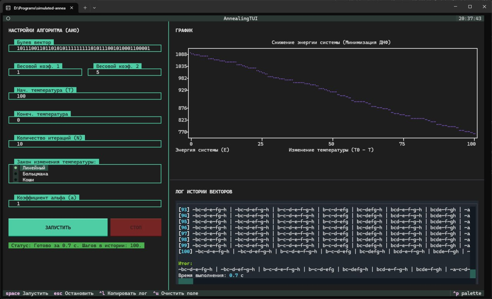

# Поиск минимальной ДНФ алгоритмом имитации отжига

Проект разработан в рамках научно-исследовательской практической работы. Приложение решает задачу минимизации дизъюнктивной нормальной формы (ДНФ) булевой функции с помощью алгоритма имитации отжига.

Основная версия программы выполнена в виде терминального TUI-приложения: пользователь задает параметры алгоритма, запускает расчет, наблюдает график изменения энергии системы и получает лог промежуточных состояний. Дополнительно в проекте есть консольная CLI-версия для запуска без интерфейсной оболочки.



## Возможности

- минимизация ДНФ булевой функции по бинарному вектору значений;
- настройка весовых коэффициентов целевой функции;
- выбор закона охлаждения: линейный, Больцмана или Коши;
- отображение графика изменения энергии в терминале;
- вывод истории найденных состояний;
- сохранение графика в `annealing_graph.png`;
- сохранение лога работы в `annealing_log.txt`;
- автоматический выбор светлой или темной темы интерфейса.

## Используемые технологии

- Python;
- Textual для терминального пользовательского интерфейса;
- textual-plotext и plotext для построения графиков в терминале;
- Rich для форматированного вывода;
- Matplotlib для сохранения графиков в PNG;
- multiprocessing для выполнения расчета без блокировки интерфейса;
- darkdetect для определения темы операционной системы.

## Структура проекта

```text
├── README.md
├── Program/
│   ├── requirements.txt
│   └── src/
│       ├── app.tcss      # стили интерфейса Textual(TUI)
│       ├── cli_main.py   # CLI-версия программы
│       ├── main.py       # TUI-приложение
│       └── process.py    # вычислительное ядро алгоритма
└── Отчет/
    ├── cover.tex
    ├── imit_vkr.sty
    ├── report.tex        # текст отчета по практике
    └── img/              # изображения для отчета
```

## Установка

Можно скачать нужные `exe` файлы со [страницы последнего релиза](https://github.com/dydojopka/simulated-annealing-dnf/releases/latest) или же собрать из исходного кода.

Для самостоятельной сборки потребуется:
- **Python** 3.11 или новее
- Для TUI-версии - терминал с поддержкой **ANSI/VT-последовательностей** и **True Color** (например: Windows Terminal, kitty или другой)

> [!IMPORTANT]
> Для TUI-интерфейса это важно: Textual использует управляющие последовательности терминала для рамок, цветов, позиционирования элементов и обновления экрана. Если терминал их не поддерживает, интерфейс может отображаться некорректно, а ANSI-коды могут выводиться как обычный текст.

> [!TIP]
> В случае отсутствия современного консольного окружения (например, на старых версиях Windows 10 и более ранних версиях ОС) можно использовать CLI-версию приложения.

1. Клонируйте репозиторий и перейдите в папку проекта:

```bash
git clone https://github.com/dydojopka/simulated-annealing-dnf.git
cd simulated-annealing-dnf
```

2. Создайте и активируйте виртуальное окружение:

    Linux:

    ```bash
    python -m venv venv
    source venv/bin/activate
    ```

    Windows:

    ```bat
    python -m venv venv
    venv\Scripts\activate
    ```

3. Установите зависимости:

```bash
pip install -r Program/requirements.txt
```

## Запуск TUI-приложения

Основной вариант запуска:

```bash
cd Program/src
python main.py
```

После запуска откроется терминальный интерфейс. В левой части окна задаются параметры алгоритма, в правой части отображаются график и лог истории состояний.

Горячие клавиши:

- `Space` - запустить алгоритм;
- `Escape` - остановить расчет;
- `Ctrl+G` - сохранить график;
- `Ctrl+L` - сохранить лог;
- `Ctrl+U` - очистить активное поле ввода.

## Запуск CLI-версии

Если нужен запуск без TUI-интерфейса, можно использовать CLI-версию:

```bash
cd Program/src
python cli_main.py
```

Программа последовательно запросит входные параметры, выполнит расчет и сохранит результаты в файлы:

- `annealing_log.txt` - история состояний и итоговая ДНФ;
- `annealing_graph.png` - график изменения энергии системы.

Файлы результата создаются в каталоге `Program/src`.

## Входные параметры

Приложение принимает следующие параметры:

- булев вектор, состоящий только из `0` и `1`;
- длина вектора должна быть степенью двойки;
- в векторе должна быть хотя бы одна единица;
- весовые коэффициенты целевой функции;
- начальная и конечная температура;
- количество итераций на температурном шаге;
- закон охлаждения;
- коэффициент `alpha` для линейного охлаждения.

Пример булевого вектора:

```text
01011101
```

## Кратко об алгоритме

Имитация отжига рассматривает текущую ДНФ как состояние системы, а значение целевой функции как энергию. На каждом шаге алгоритм изменяет состояние и сравнивает энергию нового решения с текущим. Улучшающие переходы принимаются сразу, а ухудшающие могут быть приняты с вероятностью, зависящей от температуры.

По мере охлаждения системы вероятность принятия ухудшающих переходов уменьшается. Это позволяет алгоритму сначала шире исследовать пространство решений, а затем стабилизироваться около найденного минимума.

## Отчет

Теоретическое описание задачи, постановка эксперимента и итоги работы находятся в файле [Отчет/report.tex](Отчет/report.tex).
