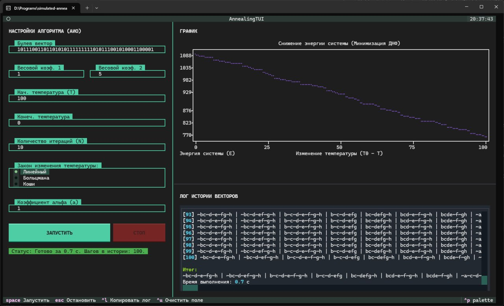

# Поиск ДНФ методом имитации отжига

Проект разработан в рамках учебной практики (научно-исследовательской работы). Программа выполняет эвристический поиск дизъюнктивной нормальной формы (ДНФ) с уменьшенной сложностью для полностью определённой булевой функции, заданной бинарным вектором значений.

В проект входят два пользовательских приложения:

- **TUI-версия** на Textual с формой настройки, графиком энергии и журналом состояний;
- **CLI-версия** с последовательным вводом параметров в командной строке.

> [!NOTE]
> Алгоритм минимизирует штрафную функцию, одновременно учитывающую число литералов и несовпадения с исходной функцией. Поэтому найденная ДНФ не обязательно является минимальной или строго эквивалентной исходному вектору. Результат следует рассматривать как эвристическое приближение.



## Возможности

- ввод булевой функции в виде вектора из `0` и `1`;
- настройка весов сложности и ошибки;
- выбор линейного закона охлаждения, закона Больцмана или закона Коши;
- настройка начальной и конечной температуры, числа соседних состояний и коэффициента `alpha`;
- выполнение расчёта в отдельном процессе без блокировки TUI;
- остановка активного расчёта пользователем;
- отображение графика изменения энергии и журнала состояний;
- сохранение графика в `annealing_graph.png`;
- сохранение журнала и итоговой ДНФ в `annealing_log.txt`;
- автоматический выбор светлой или тёмной темы интерфейса.

## Используемые технологии

- Python 3;
- [Textual](https://textual.textualize.io/) — терминальный пользовательский интерфейс;
- textual-plotext и plotext — график энергии в терминале;
- Rich — форматированный вывод;
- Matplotlib — сохранение графика в PNG;
- `multiprocessing` — выполнение расчёта в отдельном процессе;
- darkdetect — определение темы операционной системы.

Полный перечень закреплённых версий зависимостей находится в [`Program/requirements.txt`](Program/requirements.txt).

## Структура проекта

```text
├── README.md
├── numbers.txt                 # набор булевых векторов для экспериментов
├── Program/
│   ├── requirements.txt
│   └── src/
│       ├── app.tcss            # стили TUI
│       ├── cli_main.py         # CLI-версия программы
│       ├── main.py             # TUI-приложение
│       └── process.py          # вычислительное ядро
└── Отчет/
    ├── cover.tex               # титульная страница
    ├── imit_vkr.sty            # стиль LaTeX
    ├── literature.bib          # библиография
    ├── report.tex              # текст отчёта
    ├── Результаты/             # параметры, журналы и графики экспериментов
    └── img/                    # изображения отчёта
```

## Установка

Готовые исполняемые файлы, если они доступны для текущей версии, можно скачать на [странице последнего релиза](https://github.com/dydojopka/simulated-annealing-dnf/releases/latest). Для запуска из исходного кода потребуется Python 3.11 или новее. Конечная версия проекта проверялась с Python 3.14.7.

Для TUI необходим терминал с поддержкой ANSI/VT-последовательностей и True Color, например Windows Terminal или kitty.

> [!TIP]
> Если терминал некорректно отображает TUI, используйте CLI-версию приложения.

1. Клонируйте репозиторий:

   ```bash
   git clone https://github.com/dydojopka/simulated-annealing-dnf.git
   cd simulated-annealing-dnf
   ```

2. Создайте виртуальное окружение.

   Linux/macOS:

   ```bash
   python -m venv venv
   source venv/bin/activate
   ```

   Windows:

   ```bat
   python -m venv venv
   venv\Scripts\activate
   ```

3. Установите зависимости:

   ```bash
   python -m pip install -r Program/requirements.txt
   ```

## Запуск TUI-приложения

Из корня проекта выполните:

```bash
python Program/src/main.py
```

В левой части интерфейса задаются параметры алгоритма. Справа отображаются график изменения энергии и журнал состояний. Запуск и остановка доступны как кнопками, так и горячими клавишами.

| Клавиша | Действие |
|---|---|
| `Space` | запустить алгоритм |
| `Escape` | остановить активный расчёт |
| `Ctrl+G` | сохранить график |
| `Ctrl+L` | сохранить журнал |
| `Ctrl+U` | очистить активное поле ввода |

TUI не сохраняет результаты автоматически. После завершения расчёта используйте `Ctrl+G` и `Ctrl+L`. Файлы создаются рядом с `main.py`, а при запуске собранного исполняемого файла — рядом с ним.

## Запуск CLI-версии

Из корня проекта выполните:

```bash
python Program/src/cli_main.py
```

CLI последовательно запросит параметры, выполнит расчёт, выведет итоговую ДНФ и время выполнения, после чего автоматически сохранит:

- `annealing_log.txt` — историю состояний и итоговую ДНФ;
- `annealing_graph.png` — график изменения энергии.

При запуске из исходного кода файлы создаются в `Program/src`. При запуске собранного исполняемого файла они создаются рядом с ним. Ввод можно прервать сочетанием `Ctrl+C`.

## Входные параметры

### Булев вектор

- содержит только символы `0` и `1`;
- имеет длину не меньше 2;
- длина является степенью двойки: 2, 4, 8, 16 и так далее;
- содержит хотя бы одну единицу.

Если длина вектора равна $2^n$, он задаёт функцию от $n$ переменных. Пример:

```text
01011101
```

### Числовые параметры

- `S1`, `S2` — неотрицательные веса; хотя бы один должен быть больше нуля;
- `T0` — начальная температура, строго больше нуля;
- `Tf` — конечная температура, меньше `T0`;
- `N` — число генерируемых соседних состояний на температурном шаге, не меньше 1;
- `alpha` — положительный коэффициент линейного охлаждения.

Дополнительные ограничения конечной температуры:

- линейный закон: `Tf >= 0`;
- закон Больцмана: `Tf >= 2`;
- закон Коши: `Tf >= 0.01`.

## Модель оптимизации

Начальное состояние строится из минтермов всех наборов, на которых исходная функция равна единице. Импликанта представляется последовательностью символов `0`, `1` и `-`, где `-` означает отсутствие соответствующей переменной в конъюнкции.

Энергия состояния вычисляется по формуле

```text
E(S) = S1 * p1(S) + S2 * p2(S),
```

где:

- `p1(S)` — суммарное число литералов в ДНФ;
- `p2(S)` — число несовпадений полученной функции с исходным булевым вектором.

На каждом температурном шаге формируется `N` соседних состояний и выбирается состояние с наименьшей энергией. Улучшающий переход принимается всегда, а ухудшающий — с вероятностью

```text
exp(-deltaE / T).
```

При `p2(S) = 0` найденная ДНФ эквивалентна исходной функции. Конечное значение `S2` не задаёт эквивалентность как жёсткое ограничение: увеличение штрафа уменьшает привлекательность ошибочных решений, но само по себе не гарантирует получение минимальной эквивалентной ДНФ.

## Законы охлаждения

В программе реализованы три закона изменения температуры:

```text
Линейный:  T(i) = T0 - alpha * i
Больцмана: T(i) = T0 / ln(1 + i)
Коши:      T(i) = T0 / i
```

Расчёт завершается, когда температура становится не больше `Tf`. Для закона Больцмана первое пересчитанное значение `T0 / ln(2)` превышает `T0`; поэтому соответствующий график может начинаться при отрицательном значении `T0 - T`.

## Ограничения

- алгоритм стохастический, поэтому повторные запуски могут давать разные результаты;
- достижение глобального минимума не гарантируется;
- эквивалентность результата исходной функции не является жёстким ограничением;
- поддерживаются только полностью определённые функции, заданные символами `0` и `1`;
- время и потребление памяти быстро растут с длиной входного вектора и числом температурных шагов.

## Отчёт

Теоретическое описание, методика экспериментов, графики и обсуждение результатов находятся в [`Отчет/report.tex`](Отчет/report.tex).
